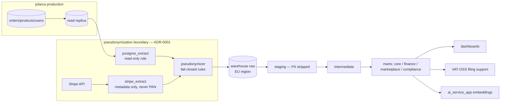

# Architecture — jolarca-data

Template-inherited baseline, extended with the platform data flow.

## Position in the fleet

| Repo | Relationship |
|------|--------------|
| `jolarca` | Source of truth (production); this repo reads a pseudonymized copy, never writes |
| `jolarca-compliance` | Retention policy, RoPA, GDPR evidence; this repo executes policy as code |
| `jolarca-legal` | Legal glossary (translation-memory sync), DSA transparency data requests |
| `jolarca-infrastructure` | Warehouse hosting, secrets, network planes; runs extract-role grants |

## Data flow (prod → pseudonymized → marts)

The boundary is the design: nothing downstream of the pseudonymizer can
re-identify a subject without external collusion (salt held outside the
warehouse, keys held in the product boundary).

## Key components

- **Governance catalog** (`governance/`) — registration, ownership,
  classification, retention for every dataset; CI blocks orphans.
- **Seed & taxonomy** (`seed/`) — the marketplace domain model and
  synthetic fixtures; schema-validated.
- **Warehouse** (`warehouse/`) — dbt models from staging to marts;
  custom tests encode pseudonymization/EUR/VAT invariants.
- **Lifecycle machinery** (`lifecycle/`) — retention jobs, erasure
  verification, legal holds, adversarial re-identification sampling.

## Constraints

1. EU region only for warehouse storage and processing.
2. No production credentials in analytics (ADR-0002).
3. Compliance marts are aggregates only.
4. Analytics is rebuildable from sources; production backups live in
   `jolarca-infrastructure`, not here.
