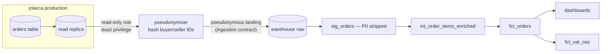
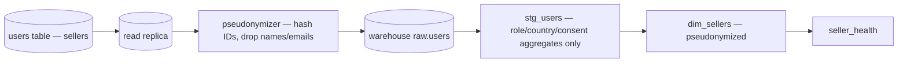
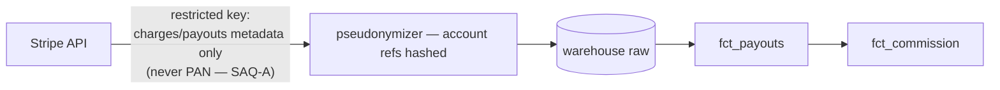
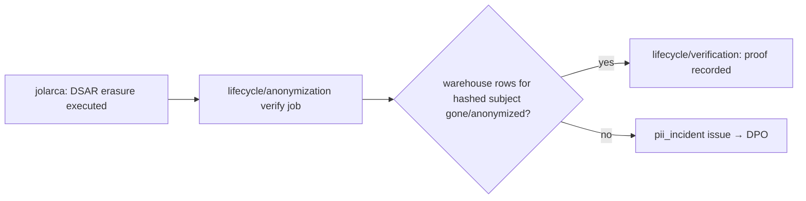

# Lineage — source → ingestion → warehouse → consumer

Per critical dataset. The pseudonymization boundary is the single most
important edge in every diagram: **nothing downstream of it may carry
cleartext identifiers** (ADR-0001).

## Orders (fct_orders)

## Sellers (dim_sellers)

## Payments (fct_payouts)

## Erasure propagation

## Maintenance rule

Any new critical dataset (CONFIDENTIAL/RESTRICTED or feeding finance
reporting) must land with a lineage diagram here in the same PR;
`dataset_request` intake asks for sources explicitly.
